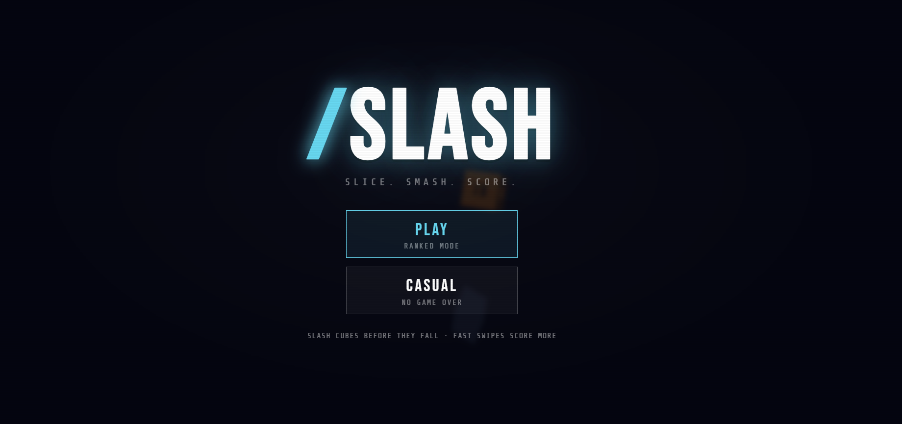

# ⚡ SLASH

A fast-paced 3D cube-slashing game built with **React + TypeScript + Vite**.


---

## 📸 Preview



---

## 🚀 Getting Started

```bash
# Install dependencies
npm install

# Start development server
npm run dev

# Build for production
npm run build

# Preview production build
npm run preview
```

---

## 🏗️ Architecture

```
src/
├── components/          # React UI components
│   ├── HUD.tsx          # In-game heads-up display
│   └── Menus.tsx        # Main / Pause / Score menus
│
├── game/                # Core game engine (pure TS)
│   ├── GameEngine.ts    # Main game loop, tick, draw
│   ├── Entity.ts        # 3D entity class + projection
│   ├── models.ts        # 3D model generators (Menger sponge)
│   ├── constants.ts     # All game tuning parameters
│   ├── mathUtils.ts     # Vector math, transforms
│   └── cooldown.ts      # Cooldown / spawner utilities
│
├── hooks/
│   └── useGame.ts       # React hook bridging engine ↔ state
│
├── types/
│   └── game.ts          # TypeScript interfaces & enums
│
├── styles/
│   └── index.css        # Full game UI styles
│
├── App.tsx              # Root component
└── main.tsx             # React entry point
```

---

## 🎮 How to Play

- **Click and drag / swipe** across cubes to slash them
- **Fast swipes** = more damage and score
- **Pink cubes** require 3 hits to destroy
- **Blue wireframe cubes** trigger **SLOW-MO** when slashed
- In **Ranked mode**, missing a cube ends the game
- In **Casual mode**, missing a cube costs score

### Controls
| Action | Input |
|--------|-------|
| Slash | Click & drag / Touch & swipe |
| Pause | Pause button (top-right) or `P` key |

---

## 🔑 Key Technical Decisions

| Concern | Approach |
|--------|----------|
| Game loop | `requestAnimationFrame` inside `GameEngine` class |
| React integration | `useGame` hook owns all React state; engine fires callbacks |
| 3D rendering | Custom software renderer on HTML Canvas 2D |
| Object pooling | Targets & fragments recycled to avoid GC pauses |
| State management | `useState` + callbacks (no Redux needed at this scale) |
| TypeScript | Strict mode, full type coverage on engine & components |

---

## 📦 Tech Stack

- **React 18** — UI components and state
- **TypeScript 5** — Type safety throughout
- **Vite 5** — Dev server and bundler
- **HTML Canvas 2D** — Game rendering (no WebGL needed)

---

## 🎨 Design

**Aesthetic**: Dark cyberpunk / arcade — deep navy backgrounds, cyan accent glow, scanline overlay.  
**Fonts**: *Bebas Neue* (display) + *Share Tech Mono* (HUD/UI).

---

Made with ⚡ React + TypeScript + Vite